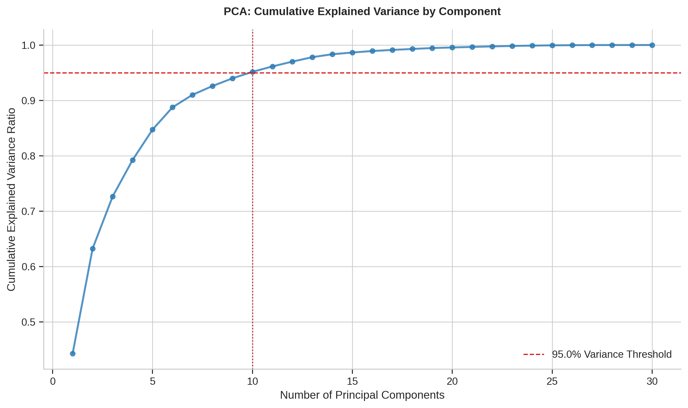
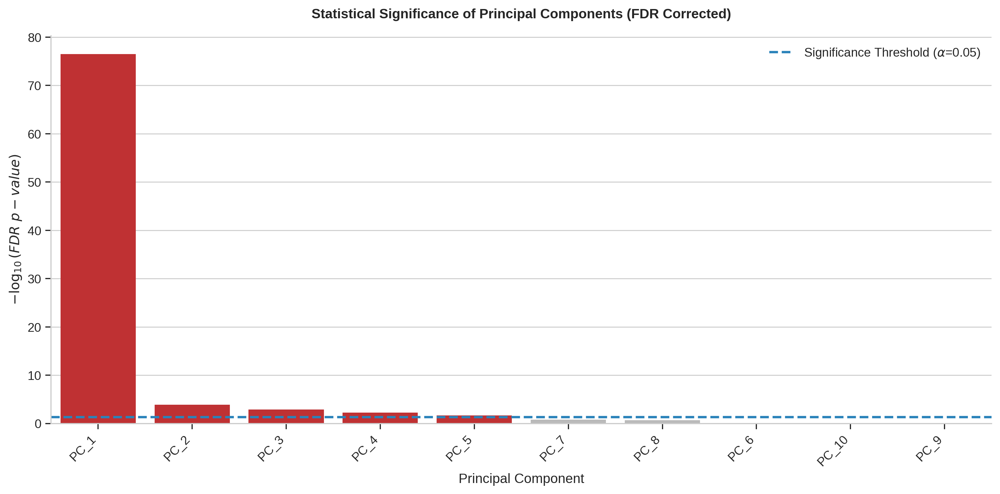
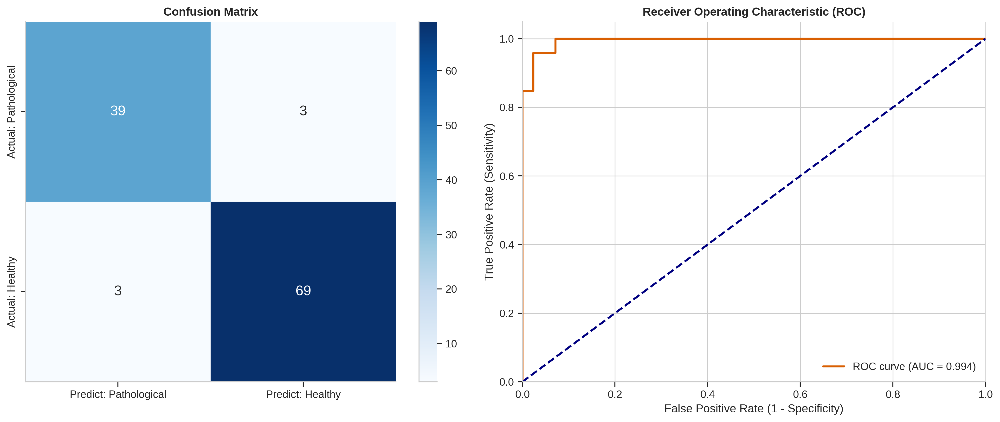
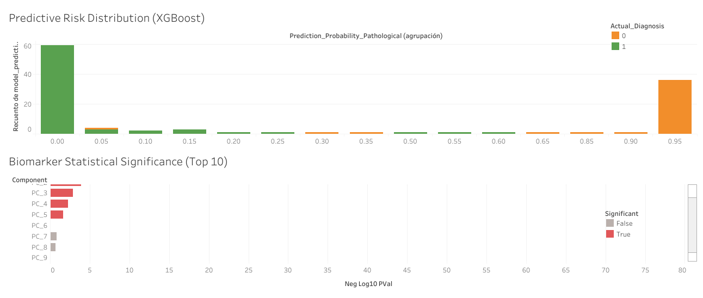

<div align="center">
  <h1>🧬 Genomic Classifier Decision Engine</h1>
  <p><i>End-to-End Decision Intelligence: From Raw Genomic Data to Clinical Diagnostics</i></p>

  <p>
    <a href="#-english-version">🇬🇧 English Version</a> | <a href="#-versión-en-español">🇲🇽 Versión en Español</a>
  </p>

  <a href="https://genomic-ml.streamlit.app/">
    
  </a>
  
  
  
</div>

---

# 🇬🇧 English Version

## 🔬 Abstract / Executive Summary
In precision medicine, the high dimensionality of genomic datasets frequently complicates clinical diagnostics. The sector struggles with the "curse of dimensionality" ($p \gg n$), where the number of biomarkers vastly exceeds the number of clinical observations, introducing severe multicollinearity and computational inefficiency.

This project applies the **Scientific Method** to structure a robust diagnostic pipeline. We transition from mathematical dimensionality reduction (PCA), through the rigorous validation of biomarker significance using Welch's T-Tests with False Discovery Rate (FDR) correction, culminating in an extreme gradient boosting classifier (`XGBoost`) that predicts tissue pathology and generates dynamic clinical reports.

---

## 🧪 Scientific Methodology & Theoretical Framework

### Phase 1: Descriptive Analysis & Dimensionality Reduction
Prior to any modeling, the dataset was audited for quality, and a mathematical transformation was required to eliminate redundant biological noise.

**Theoretical Framework (Principal Component Analysis):**
To resolve multicollinearity, we applied $Z$-score standardization ($X_{scaled} = \frac{X - \mu}{\sigma}$) followed by orthogonal transformation (PCA). We dynamically calculated the exact number of principal components required to retain a cumulative explained variance of $\geq 95\%$.

<div align="center">
  
</div>
<br>

> **Fig 1. Dimensionality Topology:** The cumulative explained variance curve maps the structural compression of the dataset, effectively reducing thousands of gene expressions into optimal orthogonal components without losing critical variance.

---

### Phase 2: Statistical Inference & Biomarker Significance
Observing biological differences is not enough; we must mathematically prove they are not the result of random chance while controlling for Type I errors (False Positives).

**Theoretical Framework (Welch's T-Test & FDR):**
We executed independent Welch's T-tests across all Principal Components. Crucially, we applied the Benjamini-Hochberg procedure to adjust our $p$-values. Components crossing the threshold line ($\alpha = 0.05$ after FDR correction) represent reliable biological markers.

<div align="center">
  
</div>
<br>

> **Fig 2. Statistical Thresholding:** The $-\log_{10}(p\text{-value})$ transformation highlights the components that passed the rigorous FDR correction, isolating the true drivers of the pathological state.

---

### Phase 3: Predictive Analytics (XGBoost)
With a statistically validated feature space, we trained a predictive algorithm to translate these biological differences into actionable diagnostics.

**Theoretical Framework (Extreme Gradient Boosting):**
The XGBoost algorithm sequentially builds decision trees, optimizing a logistic loss function to predict binary clinical outcomes (Pathological vs. Healthy). The model focuses on minimizing False Negatives (telling a sick patient they are healthy), validating its clinical viability through the ROC-AUC score and Confusion Matrix.

<div align="center">
  
</div>
<br>

> **Fig 3. Clinical Evaluation (ROC & Confusion Matrix):** Demonstrates the model's high sensitivity and specificity in distinguishing pathological tissue from healthy samples.

---

## 📊 Dual Deployment (Clinical Intelligence & BI)
The analytical pipeline was deployed across two distinct platforms to serve different end-users: clinical operations and strategic management.

### 1. Interactive Clinical Application (Streamlit)
Designed for medical personnel, enabling real-time interaction with the Machine Learning predictive engine.

*   **Tab 1 - Predictive Performance (ML):** Real-time analysis of predictive risk distribution and cohort filtering.
*   **Tab 2 - Biomarker Significance (Stats):** Interactive auditing of the top 10 most statistically significant components.
*   **Executive PDF Generator:** Closes the gap between data and clinical operations by allowing users to export static, customized PDF reports for integration into Electronic Health Records (EHR).

<div align="center">
  
  <br><br>
  <a href="https://genomic-ml.streamlit.app/">
    
  </a>
</div>
<br>

### 2. Executive Dashboard (Tableau Public)
Designed for healthcare analysts and decision-makers, providing a static, consolidated view of cohort risk and the mathematical validity of biomarkers.

<div align="center">
  
  <br><br>
  <a href="https://public.tableau.com/views/Genomic-Classifier-Decision-Engine/Dashboard1?:language=es-ES&:sid=&:redirect=auth&:display_count=n&:origin=viz_share_link">
    
  </a>
</div>

---
<br>

# 🇲🇽 Versión en Español

## 🔬 Abstract / Resumen Ejecutivo
En la medicina de precisión, la alta dimensionalidad de los datos genómicos dificulta frecuentemente el diagnóstico clínico. El sector lucha contra la "maldición de la dimensionalidad" ($p \gg n$), donde el número de biomarcadores supera ampliamente a las observaciones clínicas, introduciendo multicolinealidad severa.

Este proyecto aplica el **Método Científico** para estructurar un pipeline diagnóstico robusto. Transicionamos desde la reducción matemática de dimensionalidad (PCA), pasando por la validación rigurosa de biomarcadores mediante Pruebas T de Welch con corrección FDR (False Discovery Rate), hasta culminar en un clasificador predictivo (`XGBoost`) que dictamina la patología del tejido y genera reportes clínicos dinámicos.

---

## 🧪 Metodología, Experimentación y Marco Teórico

### Fase 1: Análisis Descriptivo y Reducción de Dimensionalidad
Antes de cualquier modelado, se auditó la calidad de los datos y se requirió una transformación matemática para eliminar el ruido biológico redundante.

**Marco Teórico (Análisis de Componentes Principales):**
Para resolver la multicolinealidad, aplicamos estandarización $Z$-score ($X_{scaled} = \frac{X - \mu}{\sigma}$) seguida de una transformación ortogonal (PCA). Calculamos dinámicamente el número de componentes necesarios para retener una varianza explicada acumulada de $\geq 95\%$.

<div align="center">
  
</div>
<br>

> **Fig 1. Topología Dimensional:** La curva de varianza explicada mapea la compresión estructural de los datos, reduciendo miles de expresiones génicas a componentes óptimos sin perder varianza crítica.

---

### Fase 2: Inferencia Estadística y Significancia de Biomarcadores
Observar diferencias biológicas no es suficiente; debemos probar matemáticamente que no son obra del azar mientras controlamos los errores de Tipo I (Falsos Positivos).

**Marco Teórico (Prueba T de Welch y FDR):**
Ejecutamos Pruebas T de Welch independientes sobre los Componentes Principales. Fundamentalmente, aplicamos el procedimiento de Benjamini-Hochberg para ajustar nuestros valores $p$. Los componentes que cruzan la línea de umbral ($\alpha = 0.05$ tras corrección FDR) representan marcadores biológicos confiables.

<div align="center">
  
</div>
<br>

> **Fig 2. Umbralización Estadística:** La transformación $-\log_{10}(p\text{-value})$ resalta los componentes que superaron la rigurosa corrección FDR, aislando a los verdaderos impulsores del estado patológico.

---

### Fase 3: Analítica Predictiva (XGBoost)
Con un espacio de características validado estadísticamente, entrenamos un algoritmo para traducir estas diferencias biológicas en diagnósticos procesables.

**Marco Teórico (Extreme Gradient Boosting):**
El algoritmo XGBoost construye árboles de decisión secuencialmente para predecir resultados clínicos binarios (Patológico vs. Sano). El modelo se enfoca en minimizar los Falsos Negativos (decirle a un paciente enfermo que está sano), validando su viabilidad mediante el puntaje ROC-AUC y la Matriz de Confusión.

<div align="center">
  
</div>
<br>

> **Fig 3. Evaluación Clínica (ROC y Matriz de Confusión):** Demuestra la alta sensibilidad y especificidad del modelo para distinguir tejidos patológicos de muestras sanas.

---

## 📊 Despliegue Dual (Inteligencia Clínica y BI)
El pipeline analítico se materializó en dos plataformas distintas para atender a diferentes usuarios finales: la operación clínica y la dirección estratégica.

### 1. Aplicación Clínica Interactiva (Streamlit)
Diseñada para el personal médico, permite la interacción en tiempo real con el motor predictivo de Machine Learning.

*   **Pestaña 1 - Rendimiento Predictivo (ML):** Análisis en tiempo real de la distribución del riesgo predictivo y filtrado de cohortes.
*   **Pestaña 2 - Significancia (Stats):** Auditoría interactiva de los 10 componentes biológicos de mayor peso estadístico.
*   **Generador Ejecutivo PDF:** Cierra la brecha entre los datos y la operación clínica permitiendo a los usuarios exportar reportes PDF estáticos y personalizados para integrarlos al Expediente Clínico Electrónico (EHR).

<div align="center">
  
  <br><br>
  <a href="https://genomic-ml.streamlit.app/">
    
  </a>
</div>
<br>

### 2. Dashboard Ejecutivo (Tableau Public)
Diseñado para analistas de salud y tomadores de decisiones, ofrece una vista estática y consolidada del riesgo de la cohorte y la validez matemática de los biomarcadores.

<div align="center">
  
  <br><br>
  <a href="https://public.tableau.com/views/Genomic-Classifier-Decision-Engine/Dashboard1?:language=es-ES&:sid=&:redirect=auth&:display_count=n&:origin=viz_share_link">
    
  </a>
</div>

---

## 🚀 Reproducibilidad del Experimento
Para ejecutar el código fuente en local:
```bash
git clone [https://github.com/Pablo-Santana-MX/Genomic-Classifier-Decision-Engine](https://github.com/Pablo-Santana-MX/Genomic-Classifier-Decision-Engine)
pip install -r requirements.txt
streamlit run streamlit_app/app.py
```

---

## 📬 Contacto y Perfil de Investigación

**Pablo Alberto Santana Flores**
*Científico de Datos | Inteligencia de Decisiones | PhDc en Ciencias Marinas*

Especializado en arquitecturas de datos modernas y Optimization Engines.
*   💼 **LinkedIn:** [linkedin.com/in/pablo-santana-mx](https://mx.linkedin.com/in/pablo-santana-mx)
*   🐙 **GitHub:** [github.com/Pablo-Santana-MX](https://github.com/Pablo-Santana-MX)
*   ✉️ **Email:** [pablo.santana@outlook.com](mailto:pablo.santana@outlook.com)
